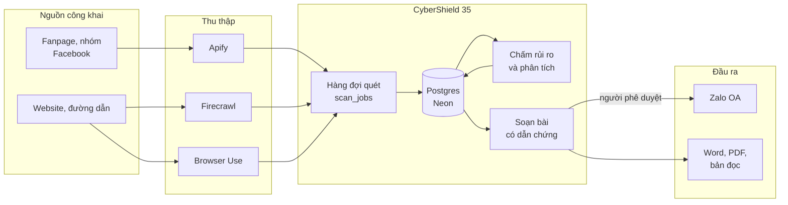
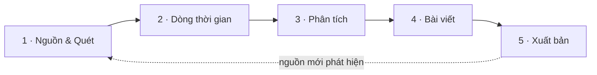
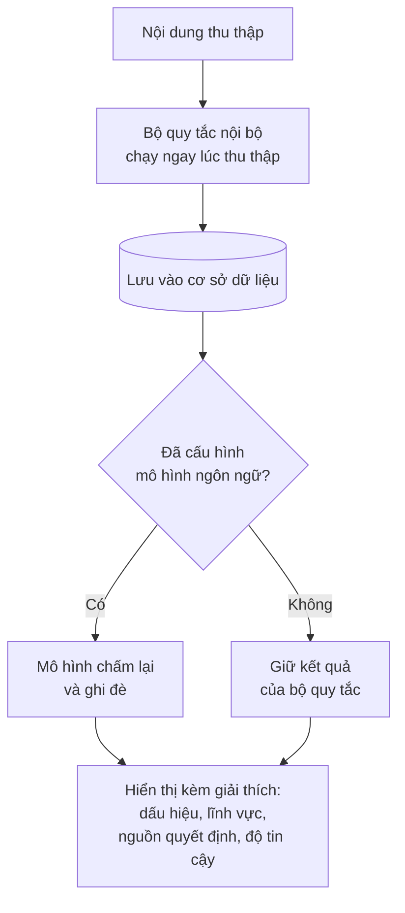
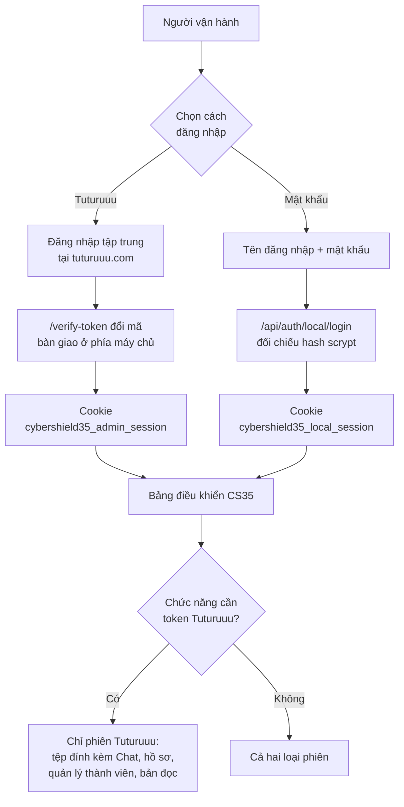
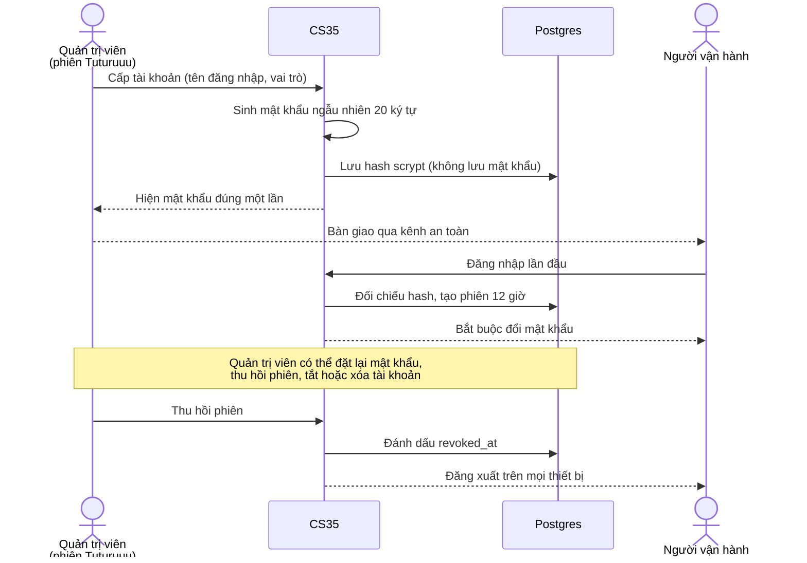
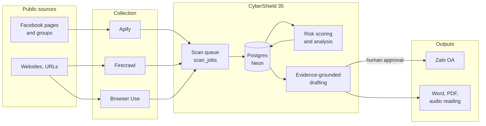
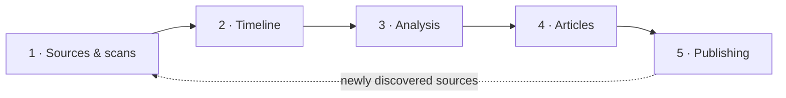
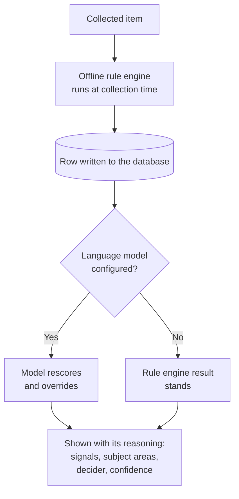
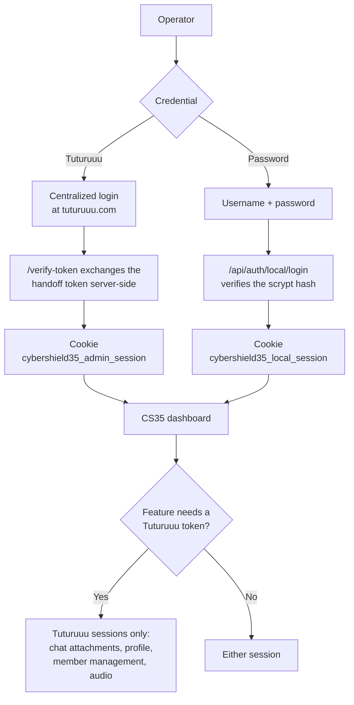
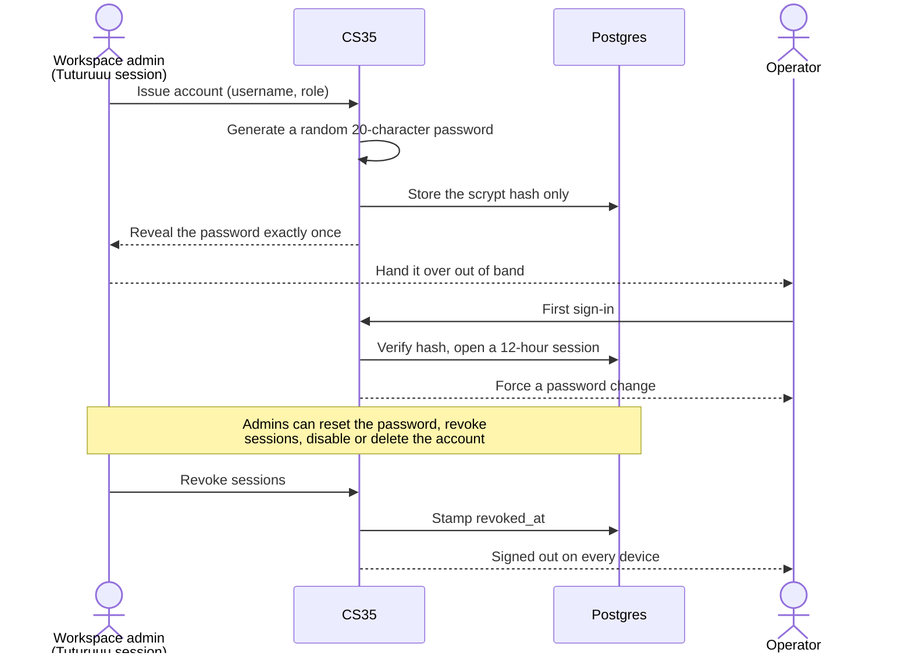

# CyberShield 35

Hệ thống theo dõi thông tin và soạn bài phản hồi có dẫn chứng, dành cho đội ngũ
vận hành của AI For Life.

<p>
  
  
  
  
  
</p>

> Tài liệu tiếng Việt là bản chính. English version is further down.

---

# Bản tiếng Việt

**Mục lục** — [CS35 làm gì](#cybershield-35-làm-gì) ·
[Kiến trúc](#kiến-trúc-tổng-thể) · [Quy trình 5 bước](#quy-trình-5-bước) ·
[Mức rủi ro](#mức-rủi-ro-được-xác-định-thế-nào) · [Cài đặt](#cài-đặt-máy-chủ) ·
[Xác thực](#xác-thực) · [Tài khoản mật khẩu](#tài-khoản-tên-đăng-nhập--mật-khẩu) ·
[Tích hợp](#tích-hợp-bên-ngoài) · [Vận hành](#vận-hành)

## CyberShield 35 làm gì

CS35 theo dõi các nguồn công khai trên mạng xã hội, chấm mức rủi ro cho từng nội
dung thu thập được, rồi giúp biên tập viên soạn bài phản hồi và đăng lên Zalo
Official Account.

Điểm cốt lõi: **máy đề xuất, người quyết định**. Không nội dung nào tự động đến
tay công chúng. Bản nháp có thể được đưa lên Zalo ở dạng ẩn để rà soát, nhưng chỉ
hiển thị công khai sau khi có người phê duyệt và bấm đăng.

## Kiến trúc tổng thể



Vercel Cron kích hoạt hai công việc định kỳ: quét nguồn hằng ngày và đẩy hàng đợi
xuất bản Zalo mỗi 5 phút.

## Quy trình 5 bước



1. **Nguồn & Quét** — khai báo fanpage, nhóm hoặc đường dẫn cần theo dõi. Hệ
   thống xếp hàng và chạy quét, hiển thị rõ đang chờ, đang quét hay đã xong.
2. **Dòng thời gian** — mọi nội dung thu thập được, sắp theo thời gian, kèm mức
   rủi ro và lý do vì sao được xếp mức đó.
3. **Phân tích** — bức tranh tổng thể: cơ cấu rủi ro, nguyên nhân, chủ đề nổi bật
   và nguồn đang tạo ra chúng.
4. **Bài viết** — soạn bản phản hồi từ dẫn chứng, có trợ lý AI hỗ trợ; mọi đề
   xuất của AI đều phải được xem lại trước khi áp dụng.
5. **Xuất bản** — đưa bản ẩn lên Zalo OA để kiểm tra, phê duyệt, rồi hiển thị
   công khai. Có thể tải bài về dạng Word, PDF hoặc bản đọc tiếng Việt.

## Mức rủi ro được xác định thế nào



Mô hình ngôn ngữ là bộ phân loại chính. Bộ quy tắc nội bộ chỉ đóng vai trò dự
phòng: nó chạy ngay lúc thu thập (trước khi có dữ liệu trong cơ sở dữ liệu) và
khi không cấu hình được mô hình.

Ở mọi nơi hiển thị mức rủi ro đều kèm phần giải thích: nhóm dấu hiệu nào đã khớp,
nội dung liên quan tới lĩnh vực gì, do mô hình hay bộ quy tắc quyết định, và độ
tin cậy là bao nhiêu. Đây là **mức ưu tiên rà soát**, không phải kết luận đúng
hay sai.

## Cài đặt máy chủ

Chạy Postgres và các dịch vụ bằng Docker:

```bash
cp .env.example .env
docker compose up --build
```

Phát triển cục bộ:

```bash
bun install
bun run db:migrate
bun run dev
```

Các lệnh thường dùng:

| Lệnh | Công dụng |
| --- | --- |
| `bun run build` | Build production, bao gồm kiểm tra kiểu |
| `bun test` | Chạy toàn bộ test |
| `bun run typecheck` | Kiểm tra kiểu phần ứng dụng |
| `bun run typecheck:test` | Kiểm tra kiểu phần test |
| `bun run lint` | Chạy ESLint |
| `bun run worker` | Chạy worker xử lý hàng đợi |
| `bun run db:generate` | Sinh migration từ thay đổi schema |
| `bun run db:migrate` | Áp dụng migration |
| `bun run db:reclassify-risk` | Chấm lại mức rủi ro cho dữ liệu đã có |
| `bun run db:regenerate-headlines` | Soạn lại tiêu đề và trích yếu |

## Xác thực

CS35 chấp nhận hai loại thông tin đăng nhập. Cả hai đều tạo phiên lưu trong
cookie HttpOnly đã mã hóa, và **không bao giờ** yêu cầu người vận hành nhập khóa
ứng dụng, khóa nhà cung cấp hay bí mật LLM trên trình duyệt.



Quyền quản trị luôn bắt nguồn từ Tuturuuu: chỉ phiên Tuturuuu có quyền quản lý
thành viên mới cấp hoặc thu hồi được tài khoản mật khẩu.

### Tài khoản Tuturuuu

Khi đã cấu hình xác thực nhưng chưa có phiên, ứng dụng hiển thị nút
`Đăng nhập bằng Tuturuuu`. Nút này đưa người dùng tới trang đăng nhập tập trung
của Tuturuuu rồi quay lại `/verify-token`, nơi CS35 đổi mã bàn giao ngắn hạn ở
phía máy chủ qua `/api/auth/verify-app-token`.

### Biến môi trường bắt buộc

- `TUTURUUU_API_BASE_URL` — phải kết thúc bằng `/api/v1`
- `TUTURUUU_CYBERSHIELD35_WORKSPACE_ID`
- `CYBERSHIELD35_APP_ID`
- `CYBERSHIELD35_APP_SECRET`
- `DATABASE_URL`

### Biến môi trường tùy chọn

- `CYBERSHIELD35_SESSION_SECRET` — chỉ dùng khi muốn khóa mã hóa cookie xoay vòng
  độc lập với `CYBERSHIELD35_APP_SECRET`. Nếu bỏ trống, hệ thống dùng
  `CYBERSHIELD35_APP_SECRET`. Khóa này mã hóa **cả hai** loại cookie phiên, nên
  xoay khóa sẽ đăng xuất mọi người.
- `TUTURUUU_WEB_APP_URL` — mặc định `https://tuturuuu.com`, dùng để dựng đường
  dẫn đăng nhập tập trung.
- `TUTURUUU_EXTERNAL_APP_APPROVAL_URL` — mặc định
  `${TUTURUUU_WEB_APP_URL}/vi/internal/infrastructure/external-apps/approve`,
  chỉ dùng cho thao tác nhanh của quản trị viên khi Tuturuuu từ chối phạm vi
  quyền mới.
- `CYBERSHIELD35_PUBLIC_APP_URL` — origin công khai, dùng khi cấu hình callback
  cho bộ lập lịch. Nếu bỏ trống, hệ thống dùng origin của request hiện tại.
- `TUTURUUU_AI_APP_URL` — mặc định `https://ai.tuturuuu.com`. Dùng để dựng liên
  kết **Mức dùng AI** ở thanh bên, đưa thẳng tới trang mức dùng của đúng workspace
  này trên Tuturuuu AI Studio. Nếu chưa cấu hình workspace, liên kết được ẩn.
- `AUTH_LOCAL_BYPASS=true` — chỉ bỏ qua kiểm tra phiên khi request đến từ
  localhost và `NODE_ENV` khác `production`. Production luôn yêu cầu phiên hợp lệ.

### Phạm vi quyền

CS35 yêu cầu các phạm vi quyền sau khi đăng nhập, khai báo trong mã nguồn:
`workspace:session`, `ai:use`, `tts:use`, `workspace:members:read`,
`workspace:members:write`, `workspace:roles:read`, `workspace:roles:write`,
`workspace:cron:read`, `workspace:cron:write`, `workspace:drive:read`,
`workspace:drive:write`, `external-projects:manage`, `users:profile:read`,
`users:profile:write`. **Không** cấu hình phạm vi quyền trên trình duyệt.

## Tài khoản tên đăng nhập + mật khẩu

Dành cho người vận hành chưa có tài khoản Tuturuuu. Quản trị viên workspace cấp
và quản lý toàn bộ vòng đời tại trang **Thành viên**.



### So sánh hai loại tài khoản

| | Tài khoản Tuturuuu | Tài khoản mật khẩu |
| --- | --- | --- |
| Cấp bởi | Tuturuuu workspace | Quản trị viên workspace, trong CS35 |
| Thời hạn phiên | Theo refresh token của Tuturuuu | 12 giờ |
| Toàn bộ quy trình 5 bước | Có | Có |
| Trợ lý AI | Qua cổng AI của Tuturuuu | Qua khóa LLM cấu hình sẵn trên máy chủ |
| Quản lý tài khoản mật khẩu | Có, nếu có quyền quản lý thành viên | Không |
| Tệp đính kèm Chat, hồ sơ, bản đọc | Có | Không |

Tài khoản mật khẩu không có danh tính trên Tuturuuu, nên trợ lý AI dùng
`LLM_API_KEY`, `OPENAI_API_KEY` hoặc `GOOGLE_GENERATIVE_AI_API_KEY` của máy chủ —
những biến vốn đã bắt buộc. Các chức năng thật sự cần token Tuturuuu sẽ trả về
thông báo rõ ràng thay vì lỗi chung chung.

### Bảo vệ

- Mật khẩu băm bằng **scrypt** (N=16384, r=8, p=1), mỗi tài khoản một salt riêng;
  cơ sở dữ liệu không bao giờ chứa mật khẩu gốc.
- Sai mật khẩu 5 lần liên tiếp khóa tài khoản 15 phút. Thông báo lỗi khi đăng
  nhập luôn giống nhau để không lộ tài khoản nào đang tồn tại.
- Cookie chỉ chứa mã phiên đã mã hóa; cơ sở dữ liệu chỉ lưu **hash** của mã đó,
  nên rò rỉ dữ liệu không thể dùng lại làm cookie.
- Đổi mật khẩu hoặc đặt lại mật khẩu sẽ thu hồi mọi phiên khác ngay lập tức.
- Chính sách mật khẩu: tối thiểu 12 ký tự, có chữ hoa, chữ thường và chữ số.

## Tích hợp bên ngoài

- **Thu thập dữ liệu** — `APIFY_TOKEN`, `FIRECRAWL_API_KEY`,
  `BROWSER_USE_API_KEY`. Khi tài khoản hết hạn mức, lượt quét dừng ngay kèm lý do
  cụ thể thay vì thử lại vô ích.
- **Zalo Official Account** — `ZALO_APP_ID`, `ZALO_APP_SECRET`,
  `ZALO_REDIRECT_URI`, `ZALO_TOKEN_ENCRYPTION_KEY`, `ZALO_OA_ENABLED`. Giới hạn
  của Zalo: tiêu đề tối đa 150 ký tự, trích yếu tối đa 300 ký tự.
- **Lịch chạy tự động** — Vercel Cron, cần `CRON_SECRET`. Có hai công việc: quét
  nguồn hằng ngày và đẩy hàng đợi xuất bản Zalo mỗi 5 phút.

## Vận hành

Trang **Nhật ký** ghi lại mọi thao tác. Khi một lượt quét hoặc một lần đăng bài
thất bại, hệ thống hiển thị nguyên nhân thật kèm việc cần làm, chứ không chỉ báo
"có lỗi".

Nếu màn hình đăng nhập báo thiếu hoặc sai cấu hình trên Vercel:

- Mở Project Settings → Environment Variables.
- Đặt đủ biến môi trường bắt buộc cho Production và Preview.
- Đặt các bí mật runtime như `DATABASE_URL`, `APIFY_TOKEN`, `FIRECRAWL_API_KEY`,
  `BROWSER_USE_API_KEY`.
- Triển khai lại bản `main` mới nhất sau khi đổi biến môi trường.
- Kiểm tra `TUTURUUU_API_BASE_URL` có kết thúc bằng `/api/v1` không, và
  `CYBERSHIELD35_APP_SECRET` đã được đặt ở phía máy chủ chưa.

---

# English version

**Contents** — [What CS35 does](#what-cybershield-35-does) ·
[Architecture](#architecture) · [Workflow](#the-five-step-workflow) ·
[Risk levels](#how-risk-levels-are-decided) · [Setup](#server-setup) ·
[Authentication](#authentication) · [Password accounts](#username--password-accounts) ·
[Integrations](#external-integrations) · [Operations](#operations)

## What CyberShield 35 does

CS35 monitors public social media sources, scores every collected item for risk,
and helps editors draft evidence-grounded responses and publish them to a Zalo
Official Account.

The core principle is that **the machine proposes and a person decides**. Nothing
reaches the public automatically. A draft can be staged on Zalo as a hidden
article for review, but it only becomes visible after someone approves it and
publishes it.

## Architecture



Vercel Cron drives two scheduled jobs: a daily source scan and a Zalo publication
queue drain every five minutes.

## The five-step workflow



1. **Sources & scans** — register the pages, groups or URLs to watch. Work is
   queued and run, showing plainly whether a scan is waiting, running or done.
2. **Timeline** — everything collected, in time order, with a risk level and the
   reasoning behind it.
3. **Analysis** — the wider picture: risk composition, causes, prominent topics
   and the sources producing them.
4. **Articles** — draft a response from the evidence, with AI assistance. Every
   AI proposal is reviewed before it is applied.
5. **Publishing** — stage a hidden version on the Zalo OA to check it, approve
   it, then make it public. Articles can also be downloaded as Word, PDF or a
   Vietnamese audio reading.

## How risk levels are decided



A language model is the authoritative classifier. The offline rule engine is a
fallback: it runs at collection time, before rows exist, and whenever no model is
configured.

Everywhere a risk level appears it carries its reasoning — which signal groups
matched, what subject areas they relate to, whether a model or the rule engine
decided, and with what confidence. It is a **review priority**, not a verdict.

## Server setup

Run Postgres and the app services with Docker:

```bash
cp .env.example .env
docker compose up --build
```

Local development:

```bash
bun install
bun run db:migrate
bun run dev
```

Common commands:

| Command | Purpose |
| --- | --- |
| `bun run build` | Production build, including type checking |
| `bun test` | Run the full test suite |
| `bun run typecheck` | Type-check the application |
| `bun run typecheck:test` | Type-check the test suite |
| `bun run lint` | Run ESLint |
| `bun run worker` | Run the queue worker |
| `bun run db:generate` | Generate a migration from schema changes |
| `bun run db:migrate` | Apply migrations |
| `bun run db:reclassify-risk` | Re-score risk for existing data |
| `bun run db:regenerate-headlines` | Rewrite titles and excerpts |

## Authentication

CS35 accepts two kinds of credential. Both produce a session held in an encrypted
HttpOnly cookie, and neither **ever** asks operators to type app credentials,
provider keys or LLM secrets in the browser.



Administrative authority always originates at Tuturuuu: only a Tuturuuu session
that Tuturuuu itself reports as a workspace member-manager can issue or revoke
password accounts.

### Tuturuuu accounts

When auth is configured but no session exists, the app shows a
`Đăng nhập bằng Tuturuuu` button. That sends the operator to Tuturuuu centralized
login and returns to `/verify-token`, where CS35 exchanges the short handoff
token server-side through `/api/auth/verify-app-token`.

### Required environment

- `TUTURUUU_API_BASE_URL` — must end in `/api/v1`
- `TUTURUUU_CYBERSHIELD35_WORKSPACE_ID`
- `CYBERSHIELD35_APP_ID`
- `CYBERSHIELD35_APP_SECRET`
- `DATABASE_URL`

### Optional environment

- `CYBERSHIELD35_SESSION_SECRET` — only when cookie encryption should rotate
  independently of `CYBERSHIELD35_APP_SECRET`. Falls back to it when unset. This
  key seals **both** session cookies, so rotating it signs everyone out.
- `TUTURUUU_WEB_APP_URL` — defaults to `https://tuturuuu.com`, used to build the
  centralized login URL.
- `TUTURUUU_EXTERNAL_APP_APPROVAL_URL` — defaults to
  `${TUTURUUU_WEB_APP_URL}/vi/internal/infrastructure/external-apps/approve`,
  used only for the admin quick action when Tuturuuu rejects newly requested app
  scopes.
- `CYBERSHIELD35_PUBLIC_APP_URL` — public origin used when scheduler callbacks
  are configured. Falls back to the current request origin.
- `TUTURUUU_AI_APP_URL` — defaults to `https://ai.tuturuuu.com`. Used to build the
  sidebar's **Mức dùng AI** link, which opens this workspace's usage page on the
  Tuturuuu AI Studio. The entry is hidden when no workspace is configured.
- `AUTH_LOCAL_BYPASS=true` — skips the session check only when the request host
  is localhost/loopback and `NODE_ENV` is not `production`. Production always
  requires a valid session.

### Requested scopes

CS35 requests these code-owned external-app scopes at login: `workspace:session`,
`ai:use`, `tts:use`, `workspace:members:read`, `workspace:members:write`,
`workspace:roles:read`, `workspace:roles:write`, `workspace:cron:read`,
`workspace:cron:write`, `workspace:drive:read`, `workspace:drive:write`,
`external-projects:manage`, `users:profile:read`, `users:profile:write`. Do
**not** configure requested scopes in the browser.

## Username + password accounts

For operators who have no Tuturuuu account. Workspace admins issue and manage the
whole lifecycle from the **Members** page.



### The two account types

| | Tuturuuu account | Password account |
| --- | --- | --- |
| Issued by | The Tuturuuu workspace | A workspace admin, inside CS35 |
| Session lifetime | The Tuturuuu refresh token | 12 hours |
| Full five-step workflow | Yes | Yes |
| AI assistance | Through the Tuturuuu AI gateway | Through the server's own LLM key |
| Manages password accounts | Yes, with member-management rights | No |
| Chat attachments, profile, audio | Yes | No |

A password account has no Tuturuuu identity, so AI assistance falls back to the
server's `LLM_API_KEY`, `OPENAI_API_KEY` or `GOOGLE_GENERATIVE_AI_API_KEY` —
which are required configuration anyway. Features that genuinely need a Tuturuuu
token return an explicit message instead of a generic failure.

### Protections

- Passwords are hashed with **scrypt** (N=16384, r=8, p=1) under a per-account
  salt; the database never holds a plaintext password.
- Five consecutive failures lock the account for 15 minutes. The login error is
  always identical, so it never reveals which usernames exist.
- The cookie carries only an encrypted session token, and the database stores
  only its **hash**, so leaked rows cannot be replayed as a cookie.
- Changing or resetting a password revokes every other session immediately.
- Password policy: at least 12 characters, with upper case, lower case and a
  digit.

## External integrations

- **Collection** — `APIFY_TOKEN`, `FIRECRAWL_API_KEY`, `BROWSER_USE_API_KEY`.
  When an account runs out of quota, scans stop immediately with the specific
  reason rather than retrying pointlessly.
- **Zalo Official Account** — `ZALO_APP_ID`, `ZALO_APP_SECRET`,
  `ZALO_REDIRECT_URI`, `ZALO_TOKEN_ENCRYPTION_KEY`, `ZALO_OA_ENABLED`. Zalo's own
  limits: 150 characters for a title, 300 for an excerpt.
- **Scheduling** — Vercel Cron, requires `CRON_SECRET`. Two jobs: a daily source
  scan and a Zalo publication queue drain every five minutes.

## Operations

The **Audit log** records every action. When a scan or a publish fails, the app
shows the real cause and what to do about it rather than a generic error.

If the login screen reports missing or invalid configuration on Vercel:

- Open Project Settings → Environment Variables.
- Set the required environment for Production and Preview.
- Set runtime secrets such as `DATABASE_URL`, `APIFY_TOKEN`,
  `FIRECRAWL_API_KEY` and `BROWSER_USE_API_KEY`.
- Redeploy the latest `main` build after changing environment variables.
- Verify that `TUTURUUU_API_BASE_URL` ends in `/api/v1` and that
  `CYBERSHIELD35_APP_SECRET` is set server-side.
